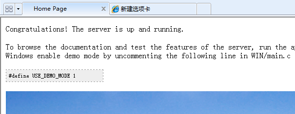

# web页面文件的缓存处理  

## 一、需要解决什么问题  
　　解决客户升级软件后每次都需要清除浏览器缓存的麻烦问题  

## 二、缓存概述  
　　*浏览器缓存的详细内容见http://www.cnblogs.com/lyzg/p/5125934.html*  
　　浏览器的缓存分为强缓存和协商缓存。区别在于协商缓存会先向服务器确认资源是否修改，没有修改才从缓存拿数据，而强缓存直接从缓存拿数据。  
* **强缓存**  
强缓存利用Expires或者Cache-Control这两个http header实现，即浏览器读这个超期时间，超期了才从服务器请求数据。 

* **协商缓存**  
协商缓存是利用的是【Last-Modified，If-Modified-Since】和【ETag、If-None-Match】这两对Header来管理的，前一对是通过文件修改时间戳判断是否修改，后一对是通过生成文件摘要判断是否修改。  
* 浏览器操作对缓存的影响  
<table>
<tr><td>用户操作</td><td>强缓存</td><td>协商缓存</td></tr>
<tr><td>地址栏回车</td><td>有效</td><td>有效</td></tr>
<tr><td>页面链接跳转</td><td>有效</td><td>有效</td></tr>
<tr><td>新开窗口</td><td>有效</td><td>有效</td></tr>
<tr><td>前进后退</td><td>有效</td><td>有效</td></tr>
<tr><td>F5刷新</td><td>无效</td><td>有效</td></tr>
<tr><td>ctrl+F5</td><td>无效</td><td>无效</td></tr>
</table>  
  
## 三、实战分析  

　　我们的产品webserver都是goahead，下载源码，编译版本，测试。测试的页面很简单，只有一个主页面，里面嵌了一个js文件，一个图片文件。  

* 浏览器地址栏不断回车，发现home.htm页面都是从服务器拿数据，而llm.js和test.png则是从缓存拿数据。点后退前进时，则全部数据都从缓存拿。  
  
为什么home.htm没有缓存呢，看了下请求，发现request header里max-age设为了0。而这并不是页面代码里设置的，所以这是浏览器的一个默认行为，**不缓存html文件，只缓存js/css/图片等文件**  
  

* 用chrome浏览器测试AC6时还发现一个有趣的问题，有时浏览器总是从服务器拿数据，不从缓存拿数据了。路由器连上网后，浏览器开始从缓存区数据。猜测这是浏览器自己的行为，判断了response字段里date值，因为路由器没同步网络时间，导致date为一个很早的时间。   
    
*firefox也是如此。IE10则总是有缓存，网络捕获里面还显示状态码304，但请求报头里If-Modified-Since字段都没有，显然IE说304是扯淡的，用的强缓存*  

### 利用http协议的Cache-Control头来处理缓存  

　　从上面的分析可以看出，webserver完全可以设置Cache-Control为no-cache，让浏览器不缓存页面。基于goahead也很好改，`websDefaultHandler()`函数改一行代码就OK了。重启server测了一下，发现每次response确实带了no-cache的头，浏览器也不缓存页面了，先不考虑性能，似乎这样改很好用。  
  
但反复测试发现，如果浏览器在你升级webserver之前就缓存了页面，那么这么改是不生效的，除非F5刷新才能跳过强缓存，得到no-cache头的新页面，之后这页面就都不缓存了。基于这点问题，还需要需找其他方法来消除缓存。  

### 利用文件链接添加后缀的办法

　　因为像test.png这种资源文件都以链接的形式嵌在页面文件里，浏览器分析页面时判断这个链接是否已经缓存，所以可以通过每次更新页面时都修改链接的方式来清除缓存。例如把``改为``  
* 需要处理哪些页面文件呢  
    1. html里嵌的资源文件  
    `<link href="css/reasy-ui.css" rel="stylesheet">`  
    `<script src="lang/b28n_async.js"></script>`    

    2. css里的资源文件  
    `.index-body .mastbody { background: url(../img/shadow.jpg) no-repeat center 100%; }`  

    3. js里面嵌的资源文件  
    `$(".loadding-ok img").attr("src", "./img/ok_connected.png")`  

* 添加什么后缀  
    1. 添加随机数    
    2. 添加版本号  
    3. 添加文件摘要MD5值  
**最好的策略是加文件摘要作为后缀**（分析略），这样做既可以免受缓存影响，又可以提高网页访问速度。 

## 四、实现  

>**思路：**从上面需要处理的文件可以看出，这些字符串前后并没有明显的特征。如果只是处理html里的倒是可以通过分析html标签来识别。因此只想到一个简单粗暴的方法：**不分析页面内容，搜索替换文件名**。即提取页面文件夹的文件名，以文件名作为匹配字符串，然后遍历文件，文件内容有匹配上则替换为带后缀的文件名。  


### shell实现    
　　有了思路，shell里很快就实现了。  
*nocache.sh*  
```shell
#!/bin/bash

# web资源文件链接替换脚本，leon
# 2016年10月22日15:24:27

path=$1 #输入的页面代码路径

if [ "$1" = "" ]; then
    echo "args err"
    echo "help: ./no_cache [web_path]"
    echo "example: ./no_cache ./web"
    exit -1
fi

path=${path/%\//} #去掉末尾的'/'
web_floder=${path##*/}  
save_floder=${web_floder}_nocache
save_path=${path/$web_floder/$save_floder}
mkdir -p $save_path

cp -rf $path/* $save_path
savepath_list=`find $save_path -type f ! -path "*.svn*"`

cnt1=0
cnt2=0

function replace()
{
    src=$1
    dest=$2

    for filepath in $savepath_list
    do
        case $filepath in 
            *.html|*.js|*.css)
                sed -i "s/$src/$dest/g" $filepath
                ((cnt2++))
                ;;
        esac
    done
}

for filepath in $savepath_list
do
    case $filepath in 
        *.js|*.css|*.png|*.jpg|*.gif)
            name=${filepath##*/}
            md5=`md5sum $filepath | awk '{print $1}'`
            newname=$name?$md5
            replace $name $newname
            ((cnt1++))
            ;;
    esac
done

echo "#####################################"
echo $cnt1  $cnt2

```
　　效率很低，如下是执行时间:  
```
root@ubuntu:web_cache# time ./nocache.sh web
#####################################
158 19750

real    1m11.173s
user    0m2.140s
sys     0m17.672s
```
AC6的页面共158个资源文件，125个页面可能嵌入资源文件。所以sed文件替换操作执行了19750次。user time不长，sys time很长，real time更是长达1分多钟。IO操作占用了太多时间，得写个C程序试试。  
实际上上面的脚本有个问题：**资源文件名部分重叠的问题**：如ali_code.png和code.png，处理会有问题。  


### c实现  
　　cpu操作比IO操作快很多，因此我们得尽量减少文件的读和写操作的次数。因此可以自己写文件内容替换的程序，不在shell脚本里循环使用sed。   
　　想法是这样的：读入一个页面文件到内存，然后通过关键字匹配，匹配上后做一个标记，标记以链表的形式存储，标记点存储了匹配位置的指针和匹配的关键字，每次更新标记链表时都对标记位置排序。待所有关键字匹配完，再开始写文件。写文件时以标记点来分割，一段一段写入，不匹配的直接写入，匹配的则写入关键字的替换部分。这样就保证了每个文件最多只读写了一次。  
　　效果也确实很好，整个替换操作用时0.1s  

```
root@ubuntu:web_cache# time ./replace_uri key.txt file.txt 

real    0m0.129s
user    0m0.072s
sys     0m0.048s
```
　　再整合到shell里面，shell里读文件生成MD5用时长一点，但也可以接受了。再优化就是用c完全取缔shell脚本了，但把目录遍历，过滤，MD5计算这些加进来程序势必很长了，不好维护。    
```
root@ubuntu:web_cache# time ./nocache_test.sh web2
#####################################

real    0m1.358s
user    0m0.124s
sys     0m0.132s
```

### 问题：
**1. 对于浏览器标题的小图标怎么处理**  
　　favicon.ico小图标是一个不好处理的角色。在现有产品的页面里，这个图标并没有显式的写在页面代码，而是直接放到web根目录，浏览器自动请求然后显示。因此定制时，即便已经在代码里删掉这个图标，浏览器怎么刷新都还是有。 

* 如何让浏览器不再显示这个我们已经删掉的图标？  
    - 关掉所有有这个图标的标签页  
    - 如果这个地址存储的书签里也有这图标，那么书签删掉  
    - 清空浏览器缓存，关闭浏览器再打开  
    我觉得验证小图标确确实实被删了的最好办法是：修改Lan ip，再看页面是否有这小图标  

* 如何在页面代码显式的引入小图标？  
html的head头里面加入如下语句  
`<link rel="shortcut icon" href="/favicon.ico" type="image/x-icon">`  
`<link rel="icon" href="/favicon.ico" type="image/x-icon">`  
**注意：**当请求地址带端口号时，有些浏览器则显示不了图标了。（测试发现chrome不显示，firefox显示）  

* 如何让小图标及时刷新？  
在代码中显式加入小图标的代码，并在链接部分加入后缀如'href="/favicon.ico?v=2"'，这样操作可以确保每次ico图标更新，页面就会更新。但是**如果直接删掉图标，就不好使了**，页面还是会显示原来缓存的图标。怎么办呢？**做一个中性图标**。  
制作一个透明图标或许比较好，不受标签页背景色影响，看着也不突兀。效果如下  
  
所以以后客户定制图标就用定制的，不定制就用透明图标  
*想到以后再也不用给客户解释图标问题了，好激动~*  
>*如何制作透明图标？*  
_先用ps制作一个32*32像素的透明png图片，然后用Axialis IconWorkshop打开这个图标，点左上角制作windows图标，再简简单单保存生成 ico 图标就可以了_  

***  


### 集成到编译  
　　在编译时使用脚本生成替换过uri的web目录，最终把新的web目录编译进镜像即可。  

### 文件列表  
　　代码分两部分组成，一部分是shell脚本，一部分是c代码，shell脚本里面调用编写的c程序。  

* nocache_v2.sh ------- 最终需要运行的shell脚本  
* nocache.sh ---------- 无用的老脚本  
* replace_uri.c ------- 替换uri的C代码实现  
* replace_uri --------- 对应c文件编译出的可执行文件  
* Project1.ico -------- 一个透明的ico图标  
* web ----------------- 一个测试用的web目录  
* web_nocache --------- 替换uri后的新web目录  
* pic ----------------- 写文档需要的图片文件夹  
* 其他 ---------------- 生成的中间文件  
